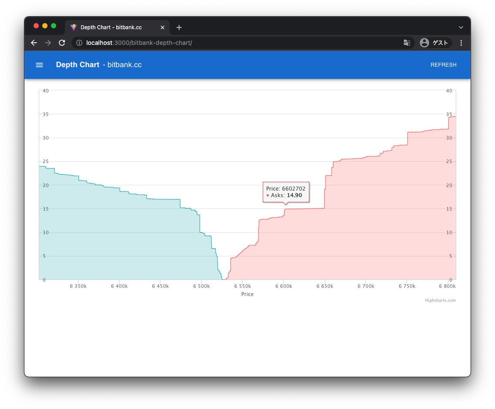

# bitbank-depth-chart

[](https://github.com/daikiojm/bitbank-depth-chart/actions/workflows/gh-pages.yml)

[bitbank.cc](http://app.bitbank.cc/) depth chart sample implementation.

**[demo]**

> This implementation is for reference only as API constraints do not allow all Depth (200 is Max).

<p align="center"></p>

## Setup

```bash
# install
yarn install

# start
yarn dev

# format code
yarn fix

# test
yarn test
```

## Stack

- [React](https://reactjs.org/)
- [MUI](https://mui.com/)
- [Highcharts](https://www.highcharts.com/) ([highcharts-react](https://github.com/highcharts/highcharts-react))
- [react-use-bitbank](https://github.com/daikiojm/react-use-bitbank)

[demo]: https://daikiojm.github.io/bitbank-depth-chart/
